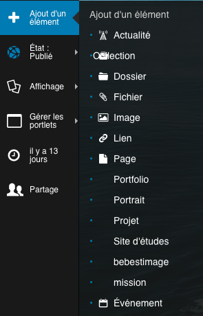

.. include:: links.rst

============================
Les types de contenus BeBEST
============================

Autant ce qui concerne la saisie des contenus spécifiques à `BeBEST`_ que sur les aspects
techniques, il y a des points communs.

.. note:: Les utilisateurs qui rentrent du contenu sont vivement encouragés à lire la partie ci-dessous
   qui concerne l'ajout d'éléments...

Voir aussi le glossaire dans le document :doc:`intro`.

Généralités sur l'ajout des éléments BeBEST
===========================================

Avant de commencer la saisie d'un élément, il faut avoir en tête la chose suivante : **l'élément
sera ajouté dans le dossier où vous vous serez préalablement placé**.

.. warning:: certains types de contenu ne sont pas explicitement nommés ``Dossier`` mais
   sont de ce *type* dans le sens où ils peuvent contenir d'autres éléments. Dans le cas de BeBEST,
   c'est le cas pour les **portfolio**, **missions**, les **projets** et les **sites d'étude**.

La saisie d'un élément commence par choisir cet élément dans le menu ``Ajout d'un élément`` :

* **les champs obligatoires** : ils sont marqués par un point rouge

  .. image:: ajout1.png
  
  Il n'est pas possible de valider le formulaire sans avoir rempli un tel champ :
  
  .. image:: ajout2.png 

* **le contenu saisi dans certains champs est vérifié**. Par exemple, saisir une adresse mail
  non valide bloque la validation du formulaire
  
  .. image:: ajout3.png
  

