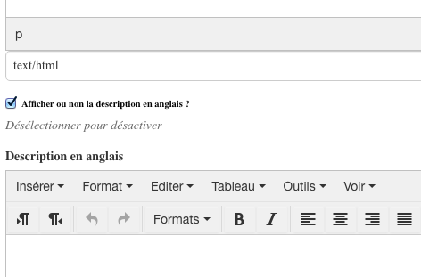

.. include:: links.rst

============================
Les types de contenus BeBEST
============================

Autant ce qui concerne la saisie des contenus spécifiques à `BeBEST`_ que sur les aspects
techniques, il y a des points communs.

.. note:: Les utilisateurs qui rentrent du contenu sont vivement encouragés à lire la partie ci-dessous
   qui concerne l'ajout d'éléments...

Voir aussi le glossaire dans le document :doc:`intro`.

Généralités sur l'ajout des éléments BeBEST
===========================================

Avant de commencer la saisie d'un élément, il faut avoir en tête la chose suivante : **l'élément
sera ajouté dans le dossier où vous vous serez préalablement placé**.

.. warning:: certains types de contenu ne sont pas explicitement nommés ``Dossier`` mais
   sont de ce *type* dans le sens où ils peuvent contenir d'autres éléments. Dans le cas de BeBEST,
   c'est le cas pour les **portfolio**, **missions**, **projets** et **sites d'étude**.

La saisie d'un élément commence par choisir cet élément dans le menu ``Ajout d'un élément`` :

.. image:: ajout.png

Une fois ce choix fait, un formulaire est présenté avec des champs de type différent. Ce peut être :

* un champ *ligne de texte*

* un champ *cadre de texte* : il n'est pas possible d'y appliquer une quelconque mise en forme

* un champ *RichText* : où l'on dispose ici d'un traitement de texte simplifié (en comparaison
  avec LibreOffice ou Word). Dans ce type de champ, on y fait une mise en forme qui peut être
  élaborée, y insérer des liens, des images, des vidéos, des tableaux, etc...

* un champ de nombre (par exemple : le facteur de zoom d'une carte)

* un champ date avec une interface sous forme de mini calendrier

* un champ image : pour *uploader* (téléverser) une image

* etc...

Certains champs spécifiques seront détaillés au cours de ce document ou dans les autres pages
relatives aux types de contenu.

D'autre part, ces champs peuvent avoir des caratéristiques si particulières qu'une vérification
est faite soit pendant la saisie du formulaire soit au moment de la validation de celui-ci
(bouton ``Enregistrer``) :

* **les champs obligatoires** : ils sont marqués par un point rouge

  .. image:: ajout1.png
  
  Il n'est pas possible de valider le formulaire sans avoir rempli un tel champ :
  
  .. image:: ajout2.png 

  .. note:: d'une façon générale, le champ ``Titre`` d'un formulaire est obligatoire. C'est
     généralement lui qui est repris pour former l'URL du nouvel élément.

* **le contenu saisi dans certains champs est vérifié**. Par exemple, saisir une adresse mail
  non valide bloque la validation du formulaire
  
  .. image:: ajout3.png
  

Quelques détails sur certains champs que l'on retrouve dans plusieurs types de contenu
======================================================================================

Les champs ``RichText`` de description détaillée de l'élément
-------------------------------------------------------------

Dans plusieurs cas, on dispose de 2 champs ``RichText``, le premier pour la version française
qui est toujours affichée, l'autre pour une éventuelle version anglaise.

Entre les deux, on a une case à cocher pour décider si on propose la version anglaise.

.. note:: si la version anglaise n'est pas faite, il est fortement conseillé de dé-cocher
   cette case pour que le bouton qui propose la version anglaise, s'il est cliqué, ne
   montre pas *du vide* ! Ce qui bien plus moche que de ne pas proposer une version
   anglaise. Cette option peut aussi être mise à profit le temps de la mise au point
   de la version anglaise.

Les champs **image**
--------------------

Généralement, on dispose (sur son ordinateur) d'images qui ont une définition **très**
supérieure à la définition utile dans un site web.

**inconvénient** : l'image est lourde à charger. Ce n'est parfois pas un problème s'il n'y en a
qu'une dans la page. Dans le cas de `BeBEST`_, on a un site très graphique qui contient beaucoup
d'images. Il faut donc veiller à réduire la définition (donc la taille et le poids en Ko) de cette
image.

L'onglet ``Categorization``
---------------------------

.. note:: ce label, issu de `Plone`_, n'est pas ou a mal été traduit.

C'est là que l'on place les mots clé quand on en a besoin. Ces mots clé sont utilisés pour repérer
des éléments que l'on place dans la page home (voir :doc:`home`). Mais ils peuvent aussi
servir pour les moteurs de recherche si on a configuré le site pour qu'il expose les
données *Dublin Core*.

Quand on veut affecter un (ou plusieurs) mot clé à un élément, une liste apparaît dès que
l'on a cliqué dans le champ. On choisit alors le/les mot(s) clé dans cette liste.

Si on désire ajouter une nouveau mot clé, il faut le taper et le terminer par la touche **Enter**
afin de valider la saisie.

On remarquera que ce nouveau mot clé apparaîtra dans la liste quand on voudra affecter des
mots clé à un autre élément.

Les champs liés à la carto
--------------------------

Selon les types de contenus, on a 2 ou trois champs liés à la cartographie.

* **zoom** : Il s'agit du niveau de zoom de la carte au moment du chargement de la page.
  Ce nombre est compris en 1 et 15. Une vérification de cette valeur est faite durant
  la saisie du formulaire.

* **Coordonnées de centrage de la carte** : Ces coodonnées sont saisies **impérativement** sous
  la forme suivante:
  
   * [latitude, longitude] : les crochets sont obligatoires, les deux valeurs sont séparés par une
     virgule (``,``)

   * Latitude : nombre flottant, forme en, c'est à dire que c'est **un point** qui sépare la partie
     décimale de la partie entière.

   * Longitude : même format que Latitude
   
   * exemple : ::
     
      [48.40003249610685, -4.5263671875]

   .. warning:: il n'y a pas de vérification sur le format de cette donnée

* Données **geojson** : le format `geojson`_ est un format bien spécifique et documenté. D'autre part
  c'est ce qui est saisi dans ce champ qui est directement utilisé pour la carte concernée. Il est
  important de veiller à ce que ce champ soit rempli correctement.
  
  .. note:: une vérification est faite sur les données entrées dans ce champ. Par exemple,
     une erreur de syntaxe flagrante sera signalée et le formulaire ne pourra pas être saisi.
     Cependant, certaines erreurs pourraient ne pas être détectées rendant la carte inutilisable
     ou fausse...

  Des détails sont donnés sur une méthode permettant la saisie de ces données geojson dans
  le document :doc:`geojson`.

