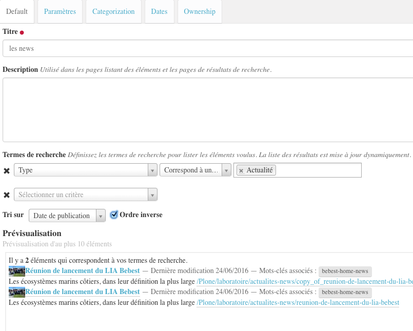
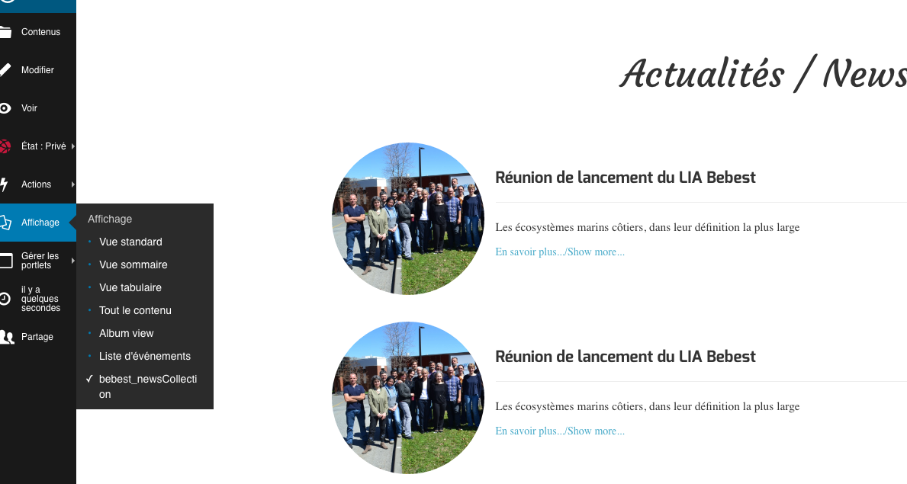

=========================
La vue collection de news
=========================

Cette vue s'applique uniquement au type de contenu ``Collection`` et n'a d'intérêt que si
cette collection contient des ``News Item`` (en français : ``Actualités``).

Pour l'utiliser, il faut donc créer une collection qui sera configurée pour
collecter les types de contenu ``Actualités``.

On préfèrera un affichage en fonction
de la date de publication, *ordre inversé* afin d'avoir les plus récentes en haut
de page.

Ce qui donnera... (mais on admettra qu'il faudra avoir un jeu de données plus riche)...

Le code
=======

