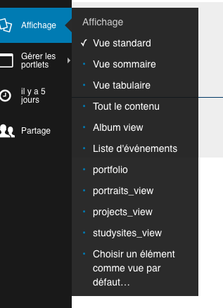
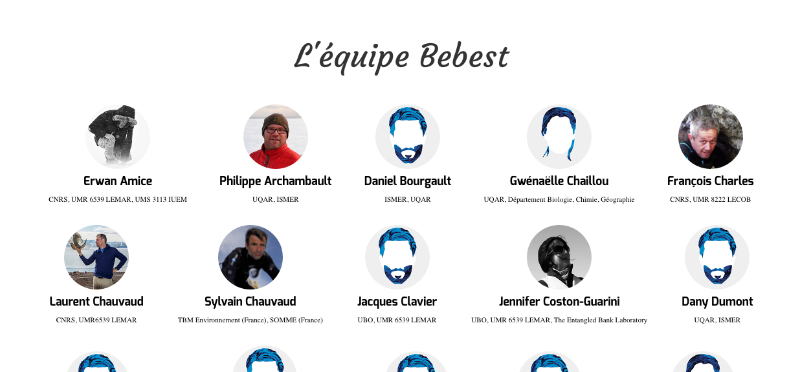

====================
Les vues des Folders
====================

Les ``Folders`` ou ``Dossiers`` sont, ramenés au niveau visuel du site, des rubriques.
Fréquemment, ils rassemblent des types de contenus similaires.

Dans ce sens, nous avons developpé des vues pour les dossiers dédiées à certains types de contenus.

.. note:: dans l'absolu, il aurait probablement été préférable de créer ces vues pour des collections...
   En fait, ces vues de dossier sont des collections pré-établies avec une présentation dédiée.

Les vues disponibles
====================

Par défaut, un dossier dispose de plusieurs types de vue qui correspondent à des présentations
différentes du dossier.

.. warning:: Le choix d'une vue pour un dossier est fait pour tous les visiteurs du site.
   Il ne s'agit pas ici de choisir comment *je veux voir le dossier*, mais comment
   *tous les visiteurs vont voir ce dossier* ! 

Les vues développées pour *BeBEST* sont les vues suivantes :

* ``portfolio`` : voir la section :doc:`misc`

* ``portraits_view`` : affiche, dans le style *BeBEST*, tous les portraits présents dans le dossier
  lui-même

* ``projects_view`` : affiche, dans le style *BeBEST*, tous les projets présents dans le dossier
 
* ``studysitesview`` : affiche, dans le style *BeBEST*, tous les sites d'étude présents dans le site
  web.

Par exemple, la vue d'un dossier qui contient des portrait :

Chaque vignette de portrait est cliquable et envoie vers la page du portrait lui-même.
