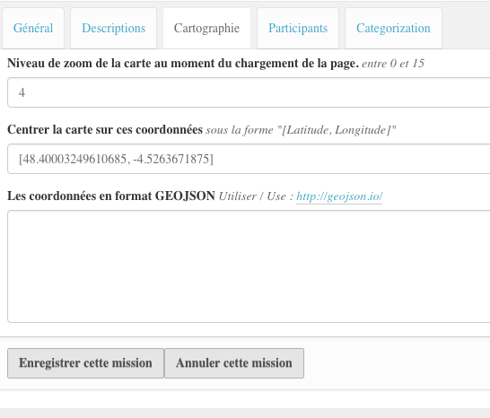
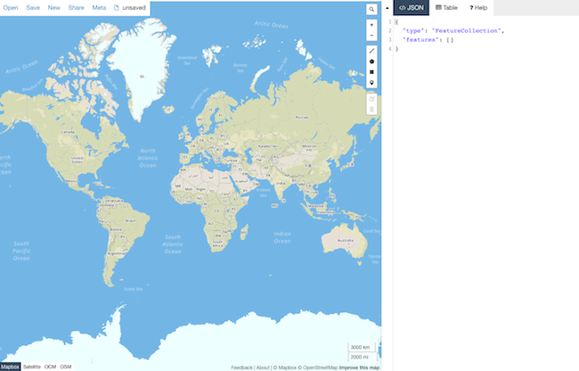
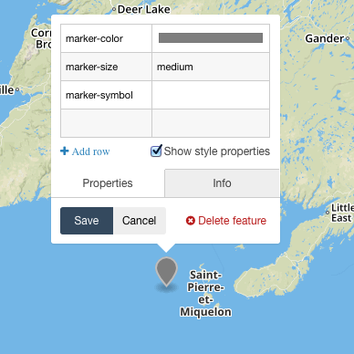
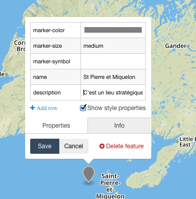
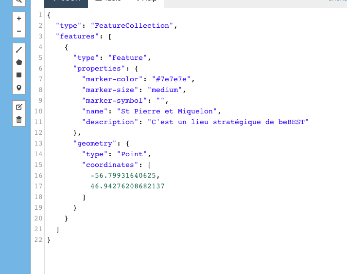

.. include:: links.rst

==========================
Entrer des données geojson
==========================

Ou comment mettre des éléments carto dans le site BeBEST et les customiser...
 

La mise en place de la carto dans ce site demande quelque attention ! Quelque soit
l'élément (spécifique à BeBEST) que l'on ajoute, il y a 2 ou 3 champs à renseigner :

* le niveau de zoom de la carte
* les coordonnées sur lequelles la carte va être centrée
* les données au format GEOJSON qui sont effectivement affichées dans la carte
  (sauf pour les projets, ce sont les données des missions qui sont affichées). 

.. note:: les données geojson entrées pour les sites d'étude ne sont pas utilisées pour
   la vue du site d'étude lui-même mais pour la page home du site. Les données affichées
   sur la carte du site d'étude sont celles des missions qui lui sont associées.

.. note:: la carte affichée lors de la vue d'un projet est la carte des missions de ce projet,
   c'est-à-dire les missions qui sont contenues DANS le "dossier" projet.

Valeurs par défaut
------------------

Pour la page HOME, le niveau de zoom, le centrage de la carte, les libellés qui
apparaissent en titre de la carte, le titre et la description du cartouche sont
tous configurés par le controlpanel.

Pour les autres, si le niveau de zoom ou les coordonnées de centrage
ne sont pas entrés, des valeurs par défaut seront utilisées, mais certainement pas
cohérentes avec la carte... il est donc grandement préférable d'en mettre qui soient valables !

Si des données geojson ne sont pas saisies, l'élément est ignoré dans la carte où il pourrait être affiché.

.. warning:: si les données geojson ne sont pas correctes, la carte peut éventuellement
   s'afficher, mais avec rien dedans ! 

Saisir les données geojson
--------------------------

Pour l'ajout ou la modification d'un élément BeBEST, le formulaire apparaît comme ci-dessous :

Pour les données geojson à proprement parlé, il est bon d'utiliser le site `geojson.io`_
qui offre une interface facile à utiliser :

* dans la partie de gauche, on a la carte elle-même et les outils pour ajouter des
  éléments : point, cercle, ligne, polygone

* dans la partie de droite, les données geojson correspondantes

Chaque élément saisi est appelé un **feature** et est intégré dans une **FeatureCollection**.

 
.. note:: une mission peut contenir plusieurs **features**, elles seront toutes affichées
   avec des attributs différents. Une mission peut donc contenir un ou
   plusieurs points/lignes/polygones/...

Un site d'études sera probablement (et de préférence) une zone, c'est-à-dire un polygone.

Quelles que soient les features ajoutés, il faudra, pour chacun, lui ajouter
2 propriétés : ``name`` et ``description``

Pour cela, il faut cliquer sur le feature dans la carte et une mini fenêtre apparaît
en popup avec les propriétés par défaut :

Sous la propriété marker-symbol, on peut ajouter ``name`` dans la colonne de gauche et la valeur
du nom dans la colonne de droite. Pour ajouter la ``description``, il faut cliquer sur "Add row"...

Après avoir cliqué sur "Save", on constate que la partie droite du site a été mise à jour :

Les données geojson peuvent alors être copiées dans le champ qui leur est destiné.

.. warning:: il faut être très vigilant à ce que les données soient copiées INTÉGRALEMENT,
   y compris tous les ``{``, ``}``, ``[``, ``]``,....

Une vérification est faite sur la validité des données goejson saisies au moment de
la validation du formulaire. Cependant, certaines erreurs peuvent ne pas être détectées...
Alors : **vigilance**

La gestion des icônes
---------------------

Les icônes ne sont à gérer que dans le cas des points. Il y a deux possibilités :

* soit on ajoute une propriété ``icon`` au feature, propriété qui fournit le nom de
  l'icône que l'on a choisi,

* soit on n'en ajoute pas, et c'est l'icône par défaut qui est affiché.

La définition des icônes se fait dans le controlpanel du module, à l'onglet "misc".
Il y a là, une liste des icônes dans un code pur javascript. C'est donc une
chose à manipuler avec précautions car si le code javascript n'est pas correct, rien
ne s'affichera dans les cartes.

Ce code javascript contient :

* les définitions des icônes

* à la fin, un tableau ``iconList`` qui contient le nom que l'on utilise pour un icône et
  l'identifiant correspondant à cet icône. Si on ajoute une définition d'un icône, il faut
  impérativement ajouter cet élément dans le tableau.

NOTE: les tableaux javascript sont des suites clé/valeur séparés par un ``:``.
Les éléments  "clé":valeur de la suite sont séparés entre eux par une virgule.
Javascript est très chatouilleux sur un aspect : **le dernier élément d'un tableau n'est
pas suivi d'une virgule**.

Le code par défaut au moment de l'installation de BeBEST::

   var defaultIcon = L.icon({
    iconAnchor: [13, 27],
    iconUrl: 'markers/marker-icon.png'
   });
   var bebestIcon = L.icon({
    iconUrl: 'bebest/++theme++plonetheme.bebest/images/leaflet/icon-orange.png',
    iconSize: [27, 40],
    iconAnchor: [13, 40],
    popupAnchor: [0, -40]
   });
   var orange = L.icon ({
    iconSize: [27, 27],
    iconAnchor: [13, 27],
    iconUrl: 'markers/icon-orange.png'
   });
   var iconList = {
    "defaultIcon": defaultIcon,
    "orange": orange,
    "bebestIcon": bebestIcon
    };

.. note:: par soucis de simplicité/facilité, on utilise le même nom pour la clé et la valeur.

La gestion des formats des lignes
---------------------------------
 
Tout comme on peut modifier l'icône d'un point, on peut adapter les propriétés des autres
types de features :

* ``stroke`` ou ``color`` : la couleur de la ligne

* ``stroke-width`` : l'épaisseur du trait

* ``stroke-opacity`` : l'opacité du trait (compris entre 0 et 1)

* ``fill`` : la couleur du remplissage d'un polygone

* ``fill-opacity`` : l'opacité du remplissage (compris entre 0 et 1)

Note technique : les propriétés ci-dessus sont celles présentées par le site `geojson.io`_.
Cependant, ce ne sont pas celles utilisées par `leaflet`_ (la librairie javascript mise en
oeuvre pour l'affichage des cartes dans ce site). Des transformations sont effectuées dans
le script ``bebest-map.js``.

 
