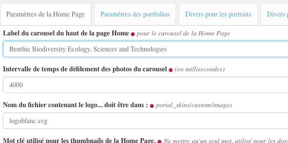
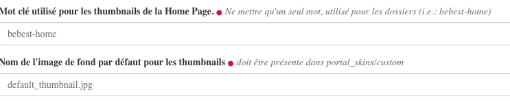
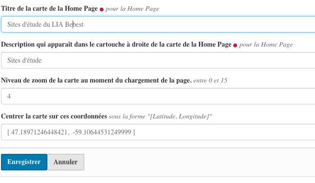

===========================
La vue de la page d'accueil
===========================

La vue ``bebest_home`` est une vue additionnelle d'un type de contenu ``Document``.

Elle est déclarée comme vue dans ``browser.zcml``::

   <browser:page
      name="bebest_home"
      for="*"
      class=".bebesthome.bebestHome"
      template="bebest_home.pt"
      permission="zope2.View"
      />

Et déclarée comme vue d'un document dans ``profile/default/types/Document.xml``::

    <property name="view_methods" purge="false">
     <element value="document_view"/>
     <element value="bebest_home"/>
     <element value="bebest_page_view"/>
    </property>

 

Fonctionnement général de la page d'accueil
-------------------------------------------

De nombreux paramètres du ``controlpanel`` permettent de configurer cette vue. Ils
seront abordés au fur et à mesure des détails de la vue.

.. warning:: Il est important de noter que la vue de cette page est presque entièrement construite
  artificiellement. En effet, on préfèrera utiliser un type de contenu ``Document`` (``Page``
  dans le menu d'ajout d'un élément), mais, à l'exception de son champ description, le
  document lui-même n'est pas utilisé. **Ce n'est qu'un support à la vue**.

* **Le carousel du haut de la page**
  
  Les images qui défilent dans ce carousel sont contenus dans un Folder qui a l'ID ``bebest-carousel``.
  
  La vitesse de défilement de ce carousel est défini, en millisecondes, dans le panneau de configuration.
  
  Le logo *BeBEST* (blanc) qui apparaît par dessus ce carousel est un fichier image dont le nom
  est défini dans le control panel. Ce fichier image **DOIT ÊTRE PRÉSENT** dans le dossier
  ``portal_skins/custom/images`` de la ``ZMI``. Actuellement, c'est le fichier ``logoblanc.svg``.
  
  Le libellé du titre qui apparaît sous le logo est défini dans le control panel.
  

* **Les thumbnails sous le carousel**

  Un maximum de 6 vignettes apparaissent ici. Le choix de ces vignettes se fait en fonction
  du mot clé qui est appliqué à des types de contenus dans le site. Ce mot clé est défini dans
  le controlpanel.
  
  L'ordre d'apparition de ces vignettes est celui de la date de publication, les éléments plubliés
  les derniers apparaisant les premier. Agir sur les dates de publication permet donc de décider
  de l'ordre d'apparition de ces vignettes.
  
  Si une vignette est un type de contenu qui n'a pas d'image, l'image par défaut sera celle
  déclarée dans le control panel. Ce fichier image **DOIT ÊTRE PRÉSENT** dans le dossier
  ``portal_skins/custom`` de la ``ZMI``.
  
  .. note:: afin de faciliter la gestion de ces vignettes, il sera judicieux de créer une collection
    qui regroupent tous les éléments du site ayant le mot clé idoine. Cette collection sera visualisée
    par ordre inversée des dates de publication. Cette collection ne servira qu'à la gestion de
    ces vignettes et sera placée dans un dossier de gestion de site et restera privée.

* **Le carousel de News**

  Le fonctionnement de ce carousel de news est similaire au fonctionnement des vignettes ci-dessus.
  
  Celles qui apparaissent sont celles qui ont le mot clé spécifique déclaré dans le control panel, elles
  apparaissent dans l'ordre inverse de date de publication.

* **La section ABOUT**

  Le titre de cette section est donné par le champ ``description`` du document qui sert de base
  à cette vue.
  
  Un maximun de trois éléments peuvent apparaitre ici. Il sont déterminés par le mot clé défini
  dans le control panel.

  On remarque aussi qu'une image apparait à droite quand, au cours du scroll de la page, on arrive
  à cette section. Cette image est définie dans le control panel et doit être présente dans
  ``portal_skins/custom/images`` de la ``ZMI``. Actuellement, c'est le fichier ``csj-soft.png``.

* **La carte**

  La carte qui apparait en fin de page présente l'ensemble des sites d'études présents. Cette
  carte n'a donc pas de fichier de données au format ``geojson``.
  
  Cependant, elle a 4 paramètres :
  
  * le titre qui apparait en haut de la carte
  
  * le titre qui apparait dans le cartouche à droite au moment du chargement de la page. Ce titre
    est remplacé par le titre d'un site d'études dès lors que l'on clique sur un élément de la carte.
  
  * le niveau de zoom de la carte au chargement de la page
  
  * les coordonnées de centrage de la carte au chargement de la page

Documentation du code
---------------------

.. autoclass:: plonetheme.bebest.browser.bebesthome.bebestHome
   :members: _getHomeObject, getCarouselText, getCarouselInterval,
    getCarouselLogoName, getCarouselImages, getCarouselThumbnails,
    getHomeNews, getAboutBgImage, getAboutUsDocuments, getAboutContainerClass,
    getAboutClasses, localText
    

