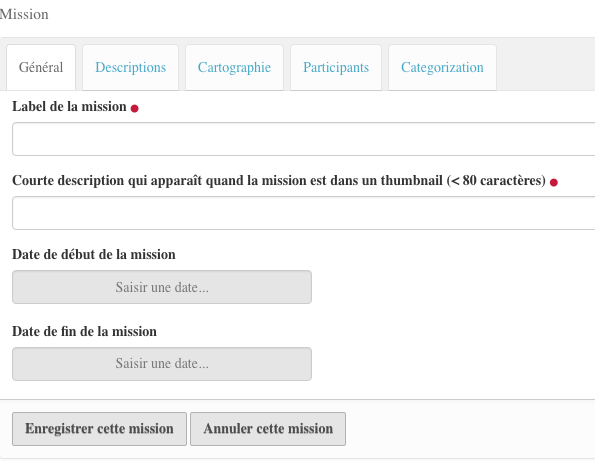

.. include:: links.rst

============
Les missions
============

.. include:: contenttypescommon1.rst

La Saisie
=========

.. warning:: L'ajout d'une mission se fait à l'intérieur d'un projet (voir :doc:`projects`)

Nous ne parlerons ici que des aspects particuliers aux missions.

Le formulaire de saisie d'une mission se présente comme ceci :

|

* Le label de la mission correspond au champ ``Titre`` que l'on trouve habituellement.

* **Courte description...** : voir :ref:`short description`

* **Dates de la mission** : un *widget* calendrier est utilisé pour saisir de façon plus simple
  les dates
  
  .. image:: mission2.png
  
  .. note:: une vérification est faite sur l'antériorité de la date de début par rapport
     à la date de fin.

* **Participants** : deux champs sont proposés ici, le chef de mission et les autres participants.
  cliquer dans le champ que l'on veut saisir provoque l'affichage de la liste des portraits déjà
  saisis.
  Pour le *Responsable scientifique*, on ne peut mettre qu'un seul portrait, pour les autres participants,
  on y ajoute de nombre que l'on veut.
  
  .. image:: mission3.png

|

Carousel
========

Pour ajouter un carousel, voir :ref:`carousels`

.. include:: contenttypescommon2.rst

Le code
=======

.. automodule:: plonetheme.bebest.mission
   :members:
   :undoc-members:

.. autoclass:: plonetheme.bebest.mission.IMission

