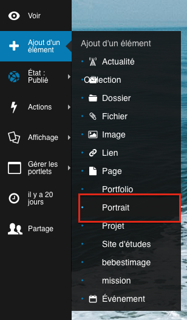
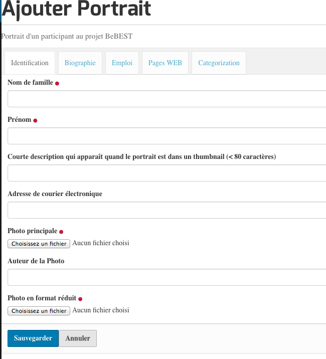

.. include:: links.rst

=============
Les portraits
=============

La saisie
=========

La création d'un nouveau portrait se fait en choisissant ``Portrait`` dans le menu ``Ajout d'un élément`` :

Plusieurs onglets sont présentés :

La vue
======

Le code
=======

