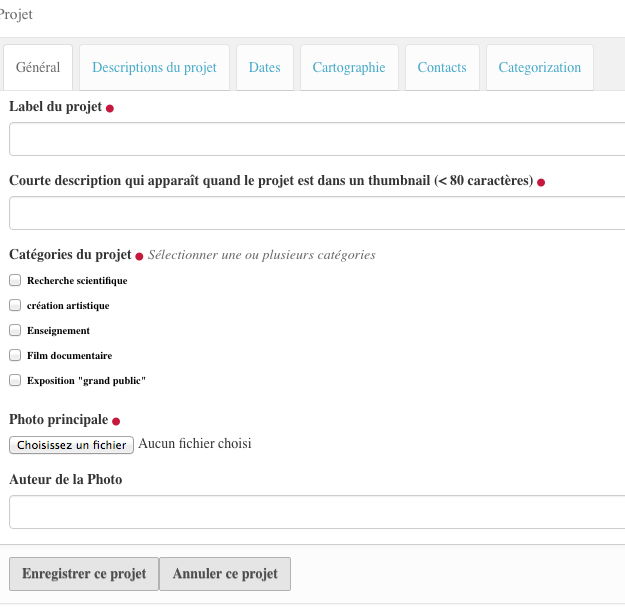

.. include:: links.rst

===========
Les projets
===========

.. include:: contenttypescommon1.rst

La Saisie
=========

Nous ne parlerons ici que des aspects particuliers aux projets.

Le formulaire de saisie d'un projet se présente comme ceci :

|

* Le label du projet correspond au champ ``Titre`` que l'on trouve habituellement.

* **Courte description...** : voir :ref:`short description`

* **Dates du projet** : un *widget* calendrier est utilisé pour saisir de façon plus simple
  les dates

* **Cartographie** : on notera ici que l'on n'entre pas de données geojon. La carte
  affichée pour un projet contient les données géographiques qui ont été entrées pour les
  missions qui sont contenues dans le projet.

* **Contacts** : Pour les trois champs *Contact principal*, *Contact français* et *Contact canadien*,
  on ne sélectionne qu'un seul portrait. Pour le champ *Autres participants*, c'est une liste
  de portrait que l'on peut saisir.
  
  Un simple clic dans un champ fait apparaître la liste des portraits déjà saisis :
  
  .. image:: projet2.png

.. include:: contenttypescommon2.rst

Le code
=======

.. automodule:: plonetheme.bebest.project
   :members:
   :undoc-members:

.. autoclass:: plonetheme.bebest.project.IProject

