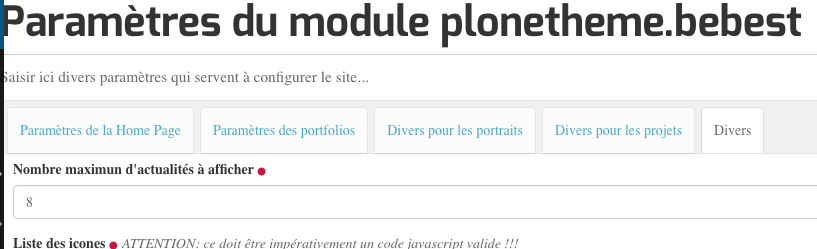

.. include:: links.rst

===============================
Les types de contenus standards
===============================

Les types de contenus sur lequels du travail a été fait pour le site BeBEST sont les suivants :

* ``Document`` (Page) : deux vues additionelles ont été développées, la vue *Home page*
  et la vue *bebest_page_view*. La première est décrite dans le document :doc:`home`, la seconde
  est décrite ci-dessous. 

* ``Folder`` : les vues des dossiers sont décrites dans le document :doc:`folder_views`

* ``News Item`` (Actualités) : voir ci-dessous

* ``Collection`` : une vue spécifique pour une collection d'actualités décrite dans le document :doc:`collection_news`

* ``Events`` : la seule modification est l'ajout du behavior ``ILeadImage``. Les événements
  ne sont pas utilisés actuellement dans le site.

La vue ``bebest_page_view``
===========================

La vue *normale* d'un document présente deux inconvénients pour le site *BeBEST* :

* on ne dispose pas de la possibilité d'afficher une version anglaise

* le style de présentation ne correspond pas au style général du site

Dans le fichier de configuration ``profile/default/types/Document.xml``, la
vue ``bebest_page_view`` est déclarée **vue par défaut**.

Le behavior ``IEnglishText`` est ajouté au type de contenu ``Document`` (voir :doc:`behaviors`)
et une template (avec la CSS qui va bien) est associée à la vue.

Les deux fichiers associés à cette vue sont ``browser/bebest_page_view.py`` et
``browser/bebest_page_view.pt``.

La vue ``bebest_news_view``
===========================

Tout comme pour les documents, la vue standard d'une actualité n'est pas satisfaisante pour
le site `BeBEST`_. La nouvelle vue (qui est la vue par défaut) présente les avantages suivants :

* elle prend en compte des deux behaviors (cf :doc:`behaviors`) ajoutés aux actualités :
  ``IEnglishText`` et ``IStartEndDates``.

* le style de présentation est cohérent avec le style du site.

D'autre part, un cartouche, en haut à droite de la vue, présente une liste d'autres actualités.
Le nombre maximal d'actualités présentes dans ce cartouche est déterminé dans le ``controlpanel``.

Le code de ``bebest_page_view``
===============================

.. autoclass:: plonetheme.bebest.browser.bebest_page_view.bebestPageView
   :members:

Le code de ``bebest_news_view``
===============================

.. autoclass:: plonetheme.bebest.browser.bebest_news_view.bebestNewsView
   :members:

