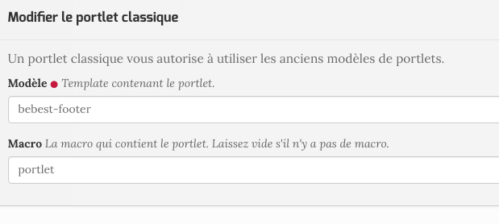

.. include:: links.rst

========
Le thème
========

Généralités
===========

Le thème de ce module est un thème `Diazo`_ et est installé dans le répertoire ``theme``. Il est basé
sur `bootstrap`_ version 3.3.6.

.. note:: la version 4 de bootstrap et sortie mais en raison de sa *jeunesse* et du fait
   qu'une large communauté connait la version 3, le choix est fait de rester à celle-ci.
   D'autre part, le thème de base de Plone (barcelonetta), dont certains éléments sont utilisés,
   est basé sur une version 3 de bootstrap.

Les spécificités de ce thème sont les suivantes :

* le fichier de règles est ``rules.xml``

* le fichier de thème est ``bebest.html`` (en remplacement du fichier habituel ``index.html``)

* Pour les menus déroulants, le module ``webcouturier.dropdownmenu`` est acivé. Cependant, la version
  courante de ce module n'est pas compatible avec plone 5. C'est donc une branche spéciale qui est
  chargée ici::
  
    webcouturier.dropdownmenu = git git://github.com/collective/webcouturier.dropdownmenu.git branch=plone5

* pour la mise en oeuvre des sous-menus, des règles spéciales s'appliquent via le fichier de règles
  ``navigation-rules.xml``::
  
   <replace css:theme-children="div#div-navbar ul#navbar">
      <xsl:for-each css:select="ul#portal-globalnav > li">
        <xi:include href="navigation-rules.xml"/>
      </xsl:for-each>
   </replace>

* on notera aussi qu'il n'y a qu'un seul niveau de menus déroulants. Les sous-menus ne sont pas *possibles*

* ce thème n'est pas prévu pour utiliser les portlets dans les colonnes de droite et gauche.
  (NB: le footer, en plone 5 est un gestionnaire de portlets).

.. note:: Il existe un thème diazo `bootstrap`_ qui sert d'exemple. D'autre part, le consortium
   *ploneintranet* a aussi mis en oeuvre un thème bootstrap. Les différentes configurations
   mises en ouvre ici sont fortement inspirées de ces travaux.

Le fichier de thème : ``bebest.html``
=====================================

Ce fichier est assez simple et la partie la plus *délicate* concerne la gestion des menus déroulants.

La *nav bar* et les menus déroulants
------------------------------------

L'ensemble est placé dans les tags ``<nav ....> ... </nav>``. Cette *nav-bar* a pour id
``portal-globalnav-wrapper`` et les classes sont celles de bootstrap.

Les entrées de base sont placées dans ``
...``.

La ``div#div-navbar`` est celle qui gère les menus déroulants. C'est à cette ``div``, et
plus spécialement à ``ul#navbar`` que s'applique les règles spécifiques de gestion des
menus déoulants. C'est là que l'on trouve, dans le fichier ``rules.xml`` les règles::

   <replace css:theme-children="div#div-navbar ul#navbar">
      <xsl:for-each css:select="ul#portal-globalnav > li">
        <xi:include href="navigation-rules.xml"/>
      </xsl:for-each>
   </replace>

où l'on voit que l'on gère les entrées fournies par ``webcouturier.dropdownmenuwebcouturier.dropdownmenu``
par les règles contenues dans le fichier ``navigation-rules.xml`` (relativement complexe à comprendre
si l'on n'est pas à l'aise avec XPath et XTransform. Cf `XSLT`_)

.. note:: des améliorations pourraient être apportées afin de disposer de sous-menus, fonctionnalité
   non accessible pour l'instant dans cette configuration. Mais on peut espérer que des geeks vont
   s'y coller !

Le corps de la page
-------------------

Cette partie est assez simple : cela consiste à remplacer la ``div#content`` du thème
par tout ce qui vient de plone dans ``div#content``.

Le footer
---------

Le thème contient une section ``<footer id="footer">...</footer>``. Cette section est remplacée
par tout ce qui vient de plone par ``#portal-footer-wrapper``.

A partir de plone 5, le footer est géré par des *portlet*.

Concrètement, pour **bebest**, l'opération consiste, dans un premier temps et par simplicité, à
supprimer les portlets *habituels* du footer de plone et ne créér qu'un seul portlet
dit ``portlet classic``.

Une template a donc été placée dans le répertoire de skins : ``skins/bebest/bebest-footer.pt``. Cette
template reprend le modèle créé par Sébastien et sera modifiable à souhait car il est placé dans
les ``skins``.

Il est mis en oeuvre en déclarant un *portlet classic* (cf ci-dessous) et en supprimant les autres
portlets.

Les resources ``javascript`` et ``css``
=======================================

Les différentes ressources venant de plone sont appliquées au thème avec les règles::

   <after css:theme-children="head" css:content="head link" />
   ...
   <after css:theme-children="head" css:content="head script" />

Elles sont donc chargées dans le navigateur en début de page.

D'autre part, le fichier principal de `bootstrap`_ est chargé en fin de thème ainsi qu'un
javascript spécifique à *bebest*. Voir en fin du fichier ``bebest.html``::

   
   

Le détail de la gestion des ressources est donnée dans une le document :ref:`resources` compte tenu
de la spécificité de cette gestion sous plone 5.

TODO
====

* ajouter des variables ``less`` pour une customisation en ligne

* créer un *vrai* portlet pour le *footer*

* améliorer *dropdown menu* pour avoir les sous-menus

